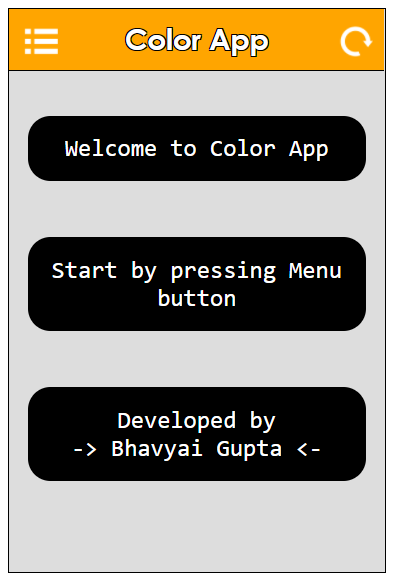

# Color App

A handy color generator and converter webapp. See it live [here](https://zbhavyai.github.io/color-app/).

## Features

+ RGB to HEX converter

+ Generate random colors with the click of a button

+ Generate gradients

## How to run

1. Clone the repository on your machine

2. Open the [index.html](index.html) file in your browser

3. Then

   1. Use the menu button on top left corner for navigation

   1. Use the reload button on top right to reset the app

   1. Use the Press button at the button to do the intended action

## Screenshots

1. Home

   
   
2. Generator

   
